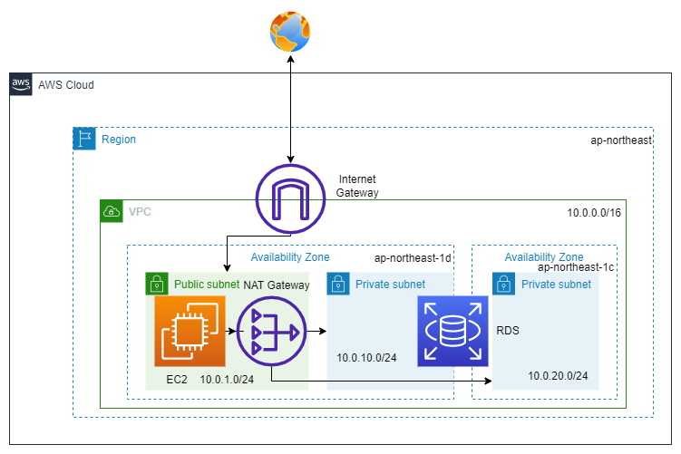

# Terraform Store について

会社で作ったものの一部 (一般的な製作物) 等を紹介。

## 目次

[使い方](#anchor2)
[フォルダ説明](#anchor3)

<a id="anchor2"></a>

## 使い方

### インストールが必要なもの

Terraform を使うにあたり、必要なものを以下に列挙。

- [AWS CLI v2](https://docs.aws.amazon.com/ja_jp/cli/latest/userguide/getting-started-install.html)
- [tfenv](https://github.com/tfutils/tfenv)
- [Terraform](https://www.terraform.io/)
- [Docker](https://www.docker.com/products/docker-desktop/)

### 設定後の使い方

1. ターミナルを起動。
2. AWS で CLI でのアクセスを許可している IAM ユーザーを使用（アクセスキーとシークレットアクセスキーを確認）。

```bash
aws configure  # --profile default
```

3. Docker で Terraform を使う場合、Docket を開いておき、以下のコマンドを入力。

```bash
cd ~~  # terraformが格納されているフォルダ
docker run -e AWS_ACCESS_KEY_ID=アクセスキー -e AWS_SECRET_ACCESS_KEY=シークレットアクセスキー -v ホストディレクトリの絶対パス:/terraform -w /terraform -it --entrypoint=ash hashicorp/terraform:1.5.5
```

4. Terraform が使えるか確認する。以下のコマンドで Terraform のバージョンを確認。

```bash
terraform version
```

5. 以下の Terraform コマンドで構築を進める。

```bash
cd ~~  # terraformが格納されているフォルダ
terraform init
terraform plan
terraform apply
terraform destroy  # 終了時
```

---

<a id="anchor3"></a>

## フォルダ説明

### 小目次

[alb-response-test](#anchor3-1)
[blog-test](#anchor3-2)

<a id="anchor3-1"></a>

### alb-response-test

ALB (Application Load Balancer) にて、ユーザーによってサーバー（サブネット）内へ通過させるか・させないかを制限（IP 制限）するテスト。
システム構成図は以下。


ALB を作成し、セキュリティグループで response が返ってくる IP アドレスリストを設定、挙動に問題が無いか確認。

#### tf ファイル

- main.tf：システム構成図に従った内容及び、ALB のリスナールール、セキュリティグループで ALB を受け取れるかどうか（IP アドレスの許可リスト）を記述。
- variables.tf：ALB のリスナールールにおいて、html でのレスポンスをしているため、変数として設定。
- outputs.tf：未使用
- iam.tf：未使用

<a id="anchor3-2"></a>

### blog-test

Wordpress にてブログを作成する構成。



#### tf ファイル

- main.tf：システム構成図に従った内容及び、EC2 におけるミドルウエアの初期作業を記述。
- variables.tf：EC2 起動時の CLI での作業（user_data：MySQL の手動セットアップ及び wordpress の細かな設定を除いた記述）を変数として設定。Terraform セットアップ後の作業を以下に記述。
- outputs.tf：未使用
- iam.tf：未使用

#### Terraform セットアップ後の作業

- AWS CLI でのアクセス

```bash
aws ssm start-session --target <インスタンス ID> --region ap-northeast-1
```

- EC2 の設定

1. Wordpress のインストール

```bash
sudo wget https://ja.wordpress.org/latest-ja.tar.gz ~/
sudo tar zxvf latest-ja.tar.gz
sudo rm latest-ja.tar.gz
```

2. RDS の mysql に接続

```bash
mysql -h {RDB のエンドポイント} -P 3306 -u {RDB ユーザー名} -p
```

3. mysql で設定

```bash
CREATE DATABASE wpdatabase;
show databases;
exit
```

4. php-fpm Config の設定

```bash
sudo nano /etc/php-fpm.d/www.conf
```

user = apache と group = apache を nginx に変更（完了したら F2 y enter）

```bash
sudo systemctl restart php-fpm
```

5. EC2 のパブリック IPv4 で nginx が見えることを確認

6. Wordpress から必要なものをコピー・設定を行う

```bash
sudo cp -r wordpress/* /usr/share/nginx/html
cd /usr/share/nginx/html
sudo cp wp-config-sample.php wp-config.php
sudo nano wp-config.php
```

7. DB_NAME DB_USER DB_PASSWORD は MySQL の設定に従う
   （一度、wpdatabase, admin, glico2030 で設定）
   https://api.wordpress.org/secret-key/1.1/salt/
   から wp-config.php 下部の設定も行う。
   DB_HOST は MySQL のエンドポイントを設定する。

```bash
sudo systemctl restart nginx php-fpm
```

8. Wordpress が見れる。必要な情報を記入していく。

- 一度 EC2 たたむと IP アドレス変わるので、MySQL の書換が必要。
- Elastic IP アドレスを設定しても良い。
